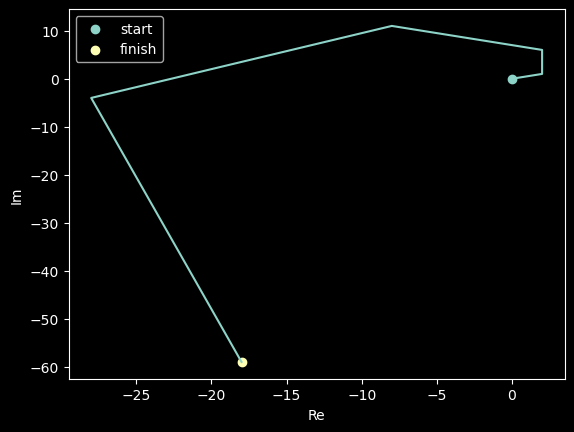

# Отчет по лабораторной работе

Здесь должны быть представлены результаты по лабораторной работе

## Краткая документация по реализованным методам

### ComplexNumber

Реализован класс `ComplexNumber` для работы с комплексными числами.

Данный класс предоставляет такие возможности, как:

1) Иннициализировать числа с помощью прототипа `ComplexNumber(real, imaginary)`, где `real` - действительная часть, а `imaginary` мнимая часть.
2) Складывать `ComplexNumber` с `ComplexNumber`
3) Умножать `ComplexNumber` на `ComplexNumber`
4) Сравнивать `ComplexNumber` с `ComplexNumber`
5) Выводить `ComplexNumber` в алгеброическом представлении

### Pandora

Ящик пандоры, который хранит неведомые тайны бытия.

> Кто знает, что будет, если его открыть.

## Исследования проводимые в работе

### Исследование поведения комплексных чисел в ящике пандоры

Для проведения данного исследования была взята некоторая точка `$x_0 = 0 + 0i$` и некоторая функция из пандоры:

```python
x * (1 + 2 * i) + 2 + i
```

Для данной функции была итеративно подставлена x. Таким образом мы получили некоторое поведение комплексного числа под действием ящика пандоры. Вот графическая демонстрация результата:



#### Локальный вывод

Сложно передать словами насколько важное наблюдение было проведено.

## Общий вывод

Исследования ящика пандоры должны продолжаться.
